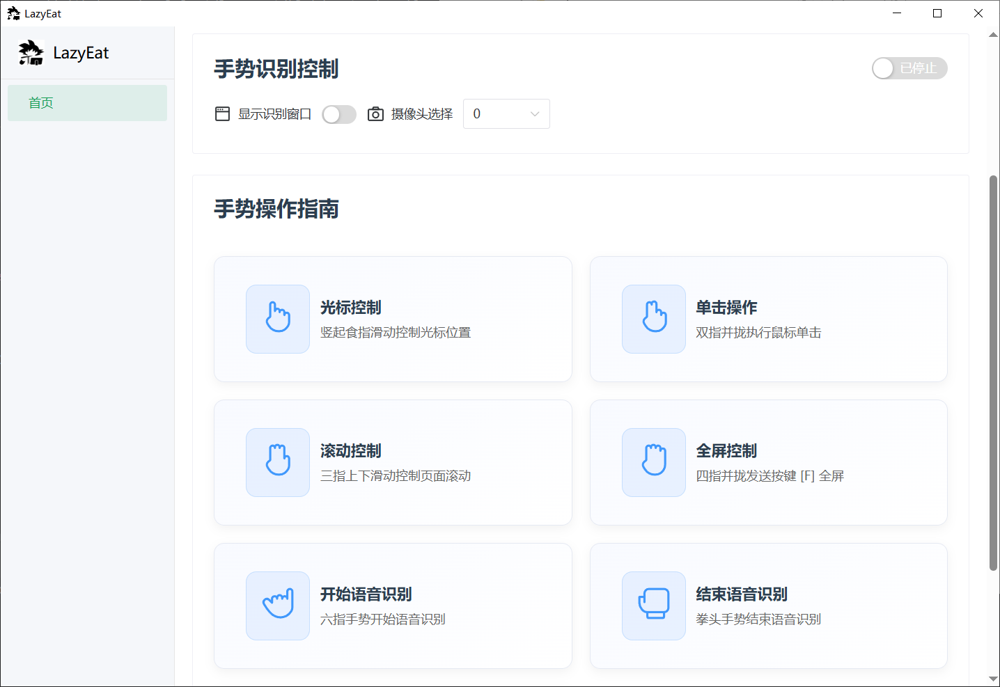
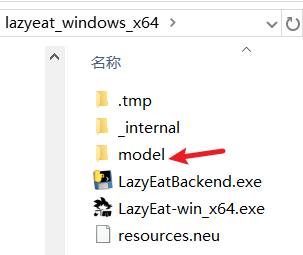

<h1 align="center">
  <a href="https://github.com/maplelost/lazy-eat/releases">
    <br>
  </a>
<div align="center">


[English README](README_EN.md)

</div>
</h1>

# 修改说明

原项目很有趣，但是由于我的笔记本摄像头离我太近，在鼠标移动时经常会离开识别范围，而且一直竖着食指也很累，所以我在原项目的基础上修改了一下操作逻辑，使用状态机不同状态控制鼠标的不同行为使其更贴近我的使用习惯。
如果你感兴趣可以试着用一下，安装包放release了。

[原项目地址](https://github.com/maplelost/lazyeat)

UI界面中的操作指引我没改，所以在这里简单说明一下操作
修改后的操作逻辑：
1. 每个操作状态都从等待手势，也就是举起一只手掌开始，举起手掌后程序开始等待具体的指令，这部分手势和原项目几乎一致，一根食指切换到移动模式，三指切换到滚轮模式……，不同的地方是将点击功能换成了握拳触发。
2. 移动模式和滚轮模式会一直保持，知道识别到等待指令，这时候就会回到1的状态等待指令。在保持过程中通过食指指尖的位置来控制鼠标移动，此时屏幕中心会有一个红色的大圈和一个小点，小点在圈内时鼠标会跟随手指移动，圈外鼠标会像被摇杆控制一样一直朝小点相对中心的方向移动，移动速度和距离成正比。滚轮的操作逻辑也是这样。
3. 点击模式：如果握拳0.5秒，则会单击，如果握拳后0.5秒内恢复成等待手势，则会双击。
4. 语音，基本和原项目一致，识别到6就一直进入语音识别状态。**但是停止语音识别的手势改为了等待手势**
5. 其他功能，其他功能都是一次性操作，没有状态持续的必要，因此在1状态下直接可以触发。
6. 退出等待，等待状态持续5秒后会自动退出。


# 🍕 Lazyeat

Lazyeat 吃饭时看剧/刷网页不想沾油手？

对着摄像头比划手势就能暂停视频/全屏/切换视频！

如果你觉得对你有用的话，不妨给我一个 star⭐ 吧~

如果有任何的想法或者建议，都可以在 [Discussions](https://github.com/maplelost/lazyeat/discussions) 中讨论喔！

# 🌠 截图

视频演示:https://www.bilibili.com/video/BV11SXTYTEJi/?spm_id_from=333.1387.homepage.video_card.click



# 📢 语音识别模型下载

[小模型](https://alphacephei.com/vosk/models/vosk-model-small-cn-0.22.zip)

[大模型](https://alphacephei.com/vosk/models/vosk-model-cn-0.22.zip)

下载后解压到 `exe` 同级的 `model` 文件夹下,才能使用语音识别功能



# 📝 TODO

- [ ] (2025 年 3 月 12 日) 嵌入 browser-use ，语音控制浏览器
- [ ] (2025 年 3 月 24 日) 开发安卓版本

[//]: # "# 📚 References"

# Star History

[](https://www.star-history.com/#maplelost/lazyeat&Date)

# 开发问题

tauri build 失败:[tauri build 失败](https://github.com/tauri-apps/tauri/issues/7338)

cargo 被墙:[cargo 被墙,换源](https://www.chenreal.com/post/599)

```
# 不知道有没有用
rm -rf ~/.cargo/.package-cache 
```


